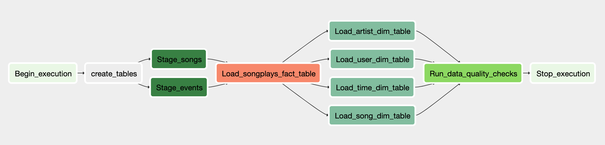
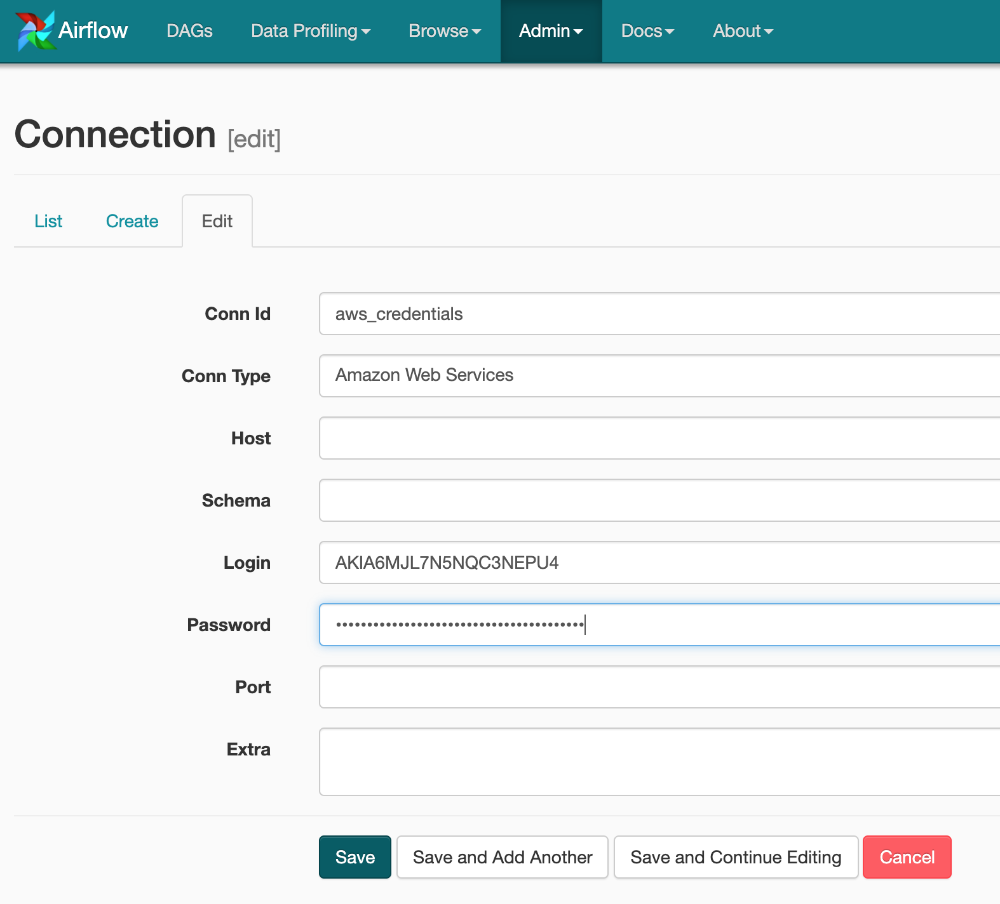
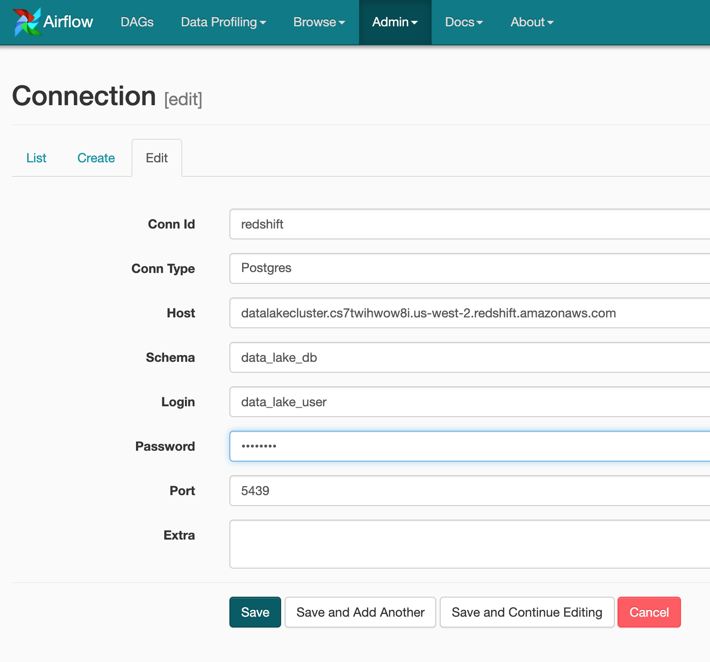

# Project Data Pipelines with Airflow


## Table of Content
1. [Introduction](#Introduction)
2. [Project Structure](#Project_Structure)
3. [Requirements](#Requirements)
4. [Getting Started](Getting_Started)

## Introduction
The goal for this project is to set up an ETL pipeline between
S3 and AWS Redshift, creating a Data Warehouse for the company, Sparkify. Their data resides in S3, in a directory of JSON logs of user activity on the app, as well as a directory with JSON metadata on the songs from their streaming app.

To complete the ETL, custom operators is created to perform tasks such as staging the data, filling the data warehouse, and running checks on the data as the final step. The DAG will run every hour and retry three times if it fails.




## Project Structure

```
Project Data Pipelines with Airflow
├── dags
│   ├── airflow_dag.py			# DAG
│   └── create_tables.sql		# Generate all tables
│
├── img
│   ├── ETL.png                 # image
│   ├── aws_cred.png			# image
│   └── redshift.png			# image
│
├── plugins            
│   ├── helpers
│   │   └── sql_queries.py		# All sql queries needed
│   │
│   └── operators
│       ├── data_quality.py		# DataQualityOperator
│       ├── load_dimension.py	# LoadDimensionOperator
│       ├── load_fact.py		# LoadFactOperator
│       └── stage_redshift.py	# StageToRedshiftOperator
│
├── CreateRedshiftCluster.ipynb	# Jupyter Notebook create cluster
│
└── README.md					# A README
```

## Requirements
* Apache Airflow
* AWS account
* Python3
* boto3
* psycopg2


## Getting Started
To run the ETL you first need to create a Redshift cluster on AWS with jeg CreateRedshiftCluster jupyter notebook. The notebook generates the cluster and creates a new IAM role and connects to the cluster.

After the Redshift cluster on AWS is up and running credentials needs to be stored in Airflow. This is done in the 'Admin' -> 'Connections' tab. Both AWS credentials and Redshift credentials needs to be stored.





Set the DAG to on and trigger it with the play button.
